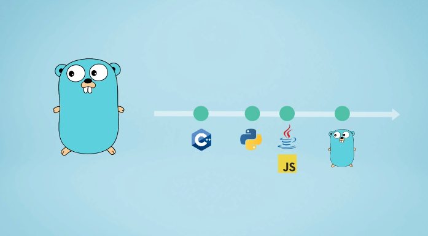
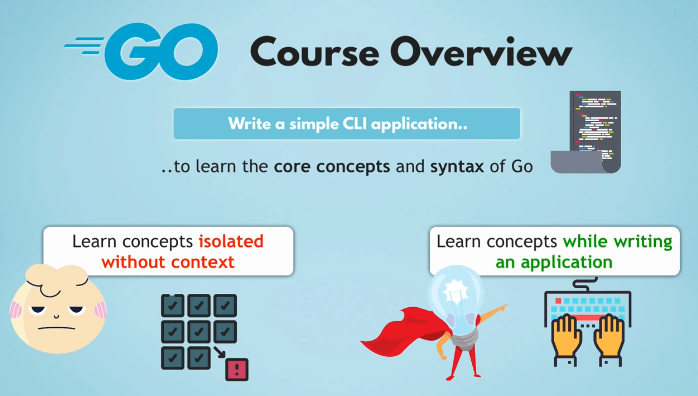
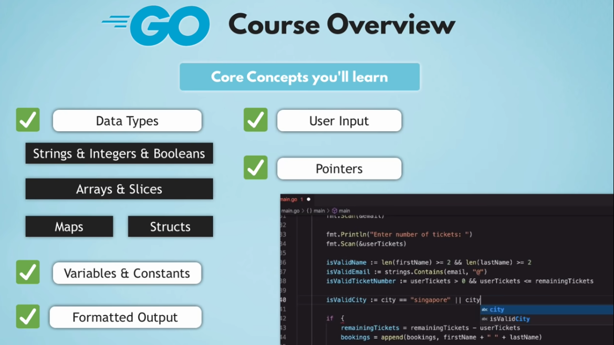

# GOLANG FULL COURSE by [Tech World with Nana](www.techworld-with-nana.com)


> Learn about one of the youngest programming languages becoming more popular in the `Cloud Engineering` world; which is `GO` or commonly known as `Golang`.
>

> 

## Course Overview
- [x] Write a simple CLI application



- Introduction to GO
- [x] Why Go was developed?
- [ ] Go use Cases
- [ ] How it compares to other programming languages? 
- Installation and Local Dev Encironment
- Basic Structure of a Go file 
- [x] Write a simple Ticket Booking Application
  - Core Concepts to learn in this project are:-
  - [x] Data Types
    - [ ] Strings & Integers & Booleans
    - [ ] Arrays and Slices
    - [ ] Maps
    - [ ] Structs
  - [x] Variables & Constants
  - [ ] Formatted Output
  - [ ] Getting and Validating `User Input`
  - [ ] Pointers
  - [ ] Scope Rules (Variable Scope)
  - [x] Control Flow
    - [ ] Loops
    - [ ] if-else & Switch
  - [x] Encapsulate Logic
    - [ ] Functions
  - [x] Organise code in
    - [ ] Packages
  - [x] Goroutines 

  - [ ] 
    - [ ] Make the application faster by using `Concurrency`
- GitHub repository to this course

### Brief History about GO
- Go or also called Golang is a;
- Programming language developed at Google in 2007
- It was later Open-sourced in 2009
- [x] Why another programming language?
- [ ] What is the purpose?
- [ ] How is it better or **different**?

### Why Go? 
> **Go Use Cases**

### Evolution of Infrastructure
- Infrastructure has changed a lot in the last few years;
- [x] **Multicore** Processors became common
- [x] **Cloud** Infrastructure with thousand of servers and hundred of processors to deploy applications became universal.
- [x] **Big Networked Computation** Clusters

#### Infrastructure became more;
- [x] Scalable & Distributed
- [ ] Dynamic
- [ ] More Capacity

#### However,
**Existing Programming Languages** did not fully take advantage of it.

For example;

Applications didn't allow `Doing multiple things at once` then but now;
> Can do Multiole things at once
e.g.
On YouTube; Watch a video as you comment, like, subscribe and download the video all in `parallel` without affecting any other task. This is a concept of **Multi-Threading** 

- [x] Multi-Threading
> Doing multiple things at once without affecting any other task - this concept is Muilt-threading.
> 
> Applications do the above.
> 
> Each thread is processing one task and you can have many of them running in parallel.
> 
> This makes applications fast.

**Challenges of Multi-Threading**
- Multiple users editing the same document
  - One user might override the changes the other user is making.
  - Editing a document at the same time by many us
- Multiple users booking the same time
  - Two users booking the last one ticket at the same time
  - This should happen **without** double booking
> Prevent double booking with -> Concurrency

**Concurrency** is about dealing with lots of things at once.
- Concurrency needs to be handled by developers in `code`.
- Developers need to write code to prevent conflicts;
  - when tasks run in parallel
  - accessing shared data

#### Multi-Core Concurrency Support
> Many languages do have features for implementing such applications however the code can get to complex in handling and preventing concurrecny issues can be pretty hard.
>
> Complexity causes higher risks of human errors.

### This is where the main purpose and difference of GO comes to life.

### Why GO?!
> Go was designed exactly for that purpose. 
> 
> To make writing `Multi-Threaded Concurrent` applications that take advantage of new performant infrastructure much easier.

- [x] Go was designed to run multiple cores and built to support concurrency
- [x] Concurrency in Go is **cheap** and **easy**
> Use this in `Goroutines`. 

#### Main Use Case of Go
- For **Performant** Applications
- Running on **scaled, distributed systems**
> Writing applications that are very performant that will run on modern scaled and distributed infrastructure with hundred and thousands of servers typically on a cloud platform.

### Go Language Characteristics
> Chanracteristics of Go

- Attemp to combine both:
 - [x] **Simple and readable** syntax of a dynamically typed language like Python.
 - [x] **Efficiency and safety** of a lower-level, statically typed language like C++

- **Server-Side** or Backend Language
- [x] Microservices
- [x] Web Applications
- [x] Database Services
> Many cloud technologies or technologies that run on modern cloud environments are actually written in `GO`; like:
> - Docker
> - HashiCorp Vault
> - Kubernetes
> - Cockroach DB, etc

- **Compiled** Language
  - Compiles into single binary(machine code)
  - Faster than interpreted languages like Python
  - Consistent across different OS
  - Use the binary code on any OS
- 

### Advantages of Go
- **Simple** Syntax: Easy to learn, read and write code.
> Language features left out on purpose for simplicity (Goal: easy to maintain over time)
- **Fast** build time, start up and run.
- Requires fewer resources

> GO is becoming more and more popular for writing simple automation applications and command-line interface applications for DevOPS and SRE tasts. 

## Go Syntax and Concept
> Local Setup
> - Install Go and Editor

**Local Setup - to write Go code**  
- [x] Install Go 
  - [ ] Go distribution actually comes with a Go CLI tool
- [x] Install an IDE - Editor for writing code
  - [ ] Visual Studio Code 
  - [ ] Any IDE of your choice

> VSCode Extensions for Go
> - Go (Go Team at Google)
> 

<hr>

To Start a Go project
- Create a folder e.g. booking-app
- Install VSCode extwnsions
- Create Go projects in modules (Initialize or project or "`module`")
  - Use the command below in the VSCode terminal
```go
go mod init booking-app
```
> `go mod init <module path>`
> - Creates a new module
> - Initialized a `go.mod` file
> - Describes the module: **with name/module path** and **go version** used in the program
> - The module path is also the **import path** (e.g. github.com/lailahgrant/booking-app)
> - Module path can correspond to a repository you plan to publish your module to (e.g. github.com/lailahgrant/booking-app)

<hr>

In Go, everything is organised in **packages**

- All our code must belong to a **packages**
- The first statement in Go file must be `package ...`

> `main.go` is the standard name for the main file where the Go application code is written.
